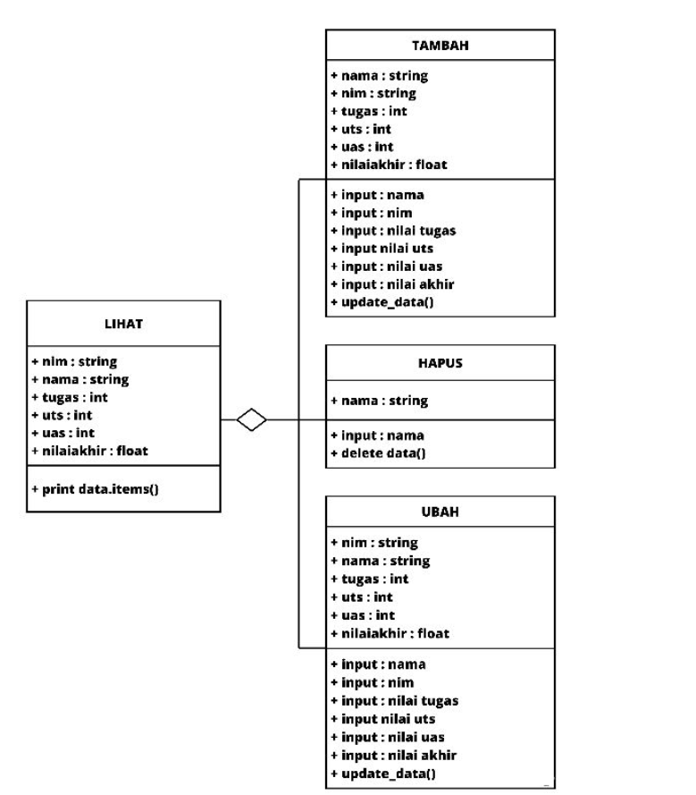
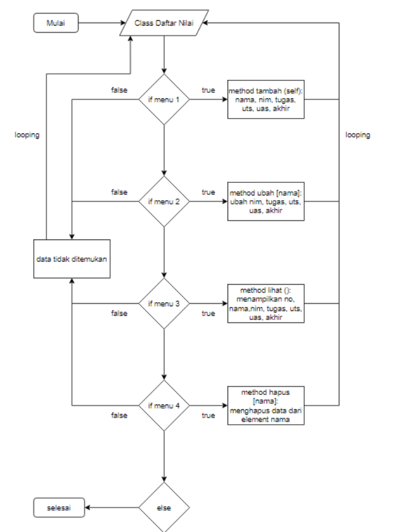

Pertemuan 12
# Python OOP
Apa itu OOP ? OOP merupakan sebuah cara untuk membangun sebuah aplikasi dengan memandang sebagai presentasi objek-objek yang saling mendukung serta berinteraksi dari satu objek ke objek yang lainnya, dan dapat dikatakan code program akan terbentuk berkelompok berdasarkan objek. Pemrograman Berorientasi Objek akan membagi-bagi code program menjadi class-class dibuat berdasarkan objek didalam sebuah aplikasi seperti bungkusan sebuah benda atau objek, objek-objek ini yang akan saling berinteraksi.

penjelasan lengkapnya bisa dilihat [disini](https://www.geriatama.com/2022/01/Dasar2-Pemrograman-BerorientasiObjek.html#:~:text=OOP%20merupakan%20sebuah%20cara%20untuk,Objek%20akan%20membagi%2Dbagi%20code) dan [disini](https://drive.google.com/file/d/1fjpSUgRmhcGvtje7GQ4JmvOlGL3bV_ri/view)


# Lab-8
Program sederhana dengan mengaplikasikan penggunaan class, untuk menampilkan daftar nilai mahasiswa.

# Diagram Class 


# Flowchart


# Source Code :
``` bash 
class mahasiswa:
    def __init__(self, nim, nama, tugas, uts, uas):
        self.nim = nim
        self.nama = nama
        self.tugas = tugas
        self.uts = uts
        self.uas = uas

    def tambah(self,nim,nama,tugas,uts,uas):
        data.nim.append(nim)
        data.nama.append(nama)
        data.tugas.append(tugas)
        data.uts.append(uts)
        data.uas.append(uas)

    def lihat(self):
        for i in range(len(data.nama)):
            print("|", i+1, "  |", end="")
            print('{0:<25}'.format(self.nama[i]), end="")
            print("|", self.nim[i], end="")
            print(" |", self.tugas[i], end="")
            print("    |", self.uts[i], end="")
            print("  |", self.uas[i], " | ", end="")
            print(f'{((self.tugas[i]*30/100) + (self.uts[i]*35/100) + (self.uas[i]*35/100)) :.2f}', " |")

    def ubah(self,nim,nama,tugas,uts,uas):
        self.nim[no] = nim
        self.nama[no] = nama
        self.tugas[no] = tugas
        self.uts[no] = uts
        self.uas[no] = uas

    def hapus(self):
        del self.nim[no]
        del self.nama[no]
        del self.tugas[no]
        del self.uts[no]
        del self.uas[no]

data = mahasiswa([],[],[],[],[])

while True:
    menu = input("\n[(L)ihat, (T)ambah, (U)bah, (H)apus, (K)eluar]:")
    if menu == "t" or menu == "T":
       print("\nTambah Data")
       data.tambah(
           input("Masukkan NIM : "),
           input("Masukkan Nama : "),
           int(input("Nilai Tugas : ")),
           int(input("Nilai UTS : ")),
           int(input("Nilai UAS : "))
           )
       print("\nData berhasil ditambahkan")

    elif menu == "l" or menu == "L":
        print("\nDaftar Nilai")
        print("==========================================================================")
        print("| No  |          Nama           |    NIM    | TUGAS | UTS | UAS |  AKHIR |")
        print("==========================================================================")
        if len(data.nama) != 0:
            data.lihat()
        else:
            print("                         TIDAK ADA DATA                               ")
        print("==========================================================================")

    elif menu == "u" or menu == "U":
        print("\nUbah Data")
        ubah = input("Masukkan Nama : ")
        if ubah in data.nama:
           no = data.nama.index(ubah)
           print("Masukkan Data Yang Baru : ")
           data.ubah(
               input("NIM : "),
               input("Nama : "),
               int(input("Nilai Tugas : ")),
               int(input("Nilai UTS : ")),
               int(input("Nilai UAS : "))
               )
        else:
            print(ubah, "tidak ada di dalam data")

    elif menu == "h" or menu == "H":
        print("\nHapus Data")
        hapus = input("Masukkan Nama : ")
        if hapus in data.nama:
            no = data.nama.index(hapus)
            data.hapus()
            print("Data", hapus, "Berhasil dihapus")
        else:
            print(hapus, "tidak ada di dalam data")

    elif menu == "k" or menu == "K":
        print("\nTerimakasih\n")
        break

    else:
        print("\nPerintah yang dimasukkan salah!\n")
``` 

# Penjelasan 
1. # Membuat class
Jadi Apa itu Class ? Class merupakan sebuah rancangan atau blueprint dari sebuah objek. Untuk membuat sebuah kelas pada Bahasa Python dimulai dengan menggunakan kata kunci class dan dikuti dengan titik dua (:).
``` class mahasiswa: ```

2. # Membuat Objek 
Untuk membuat sebuah objek harus memiliki sebuah class.
``` bash
def __init__(self, nim, nama, tugas, uts, uas):
        self.nim = nim
        self.nama = nama
        self.tugas = tugas
        self.uts = uts
        self.uas = uas
``` 
*( nim, nama, nilai, tugas, uts, uas merupakan sebuah objek.)*

**Fungsi __init__()**
Semua class memiliki fungsi yang disebut __init__(), yang selalu dijalankan ketika class sedang dimulai. Disamping itu gunakan fungsi __init__() untuk menetapkan nilai ke properti objek, atau operasi lain yang perlu dilakukan saat objek sedang dibuat. Ingat jika mendeklarasikan sebuah fungsi akan dimulai dengan kata kunci def.

3. # Kita akan buat beberapa method untuk menambahkan, menampilkan, mengubah, dan menghapus data mahasiswa. a. Pertama membuat method tambah(), method ini berfungsi untuk menambahkan data. Dalam method ini kita menggunakan append() agar data yang terakhir ditambahkan ada di urutan list paling akhir.
``` bash 
def tambah(self,nim,nama,tugas,uts,uas):
        data.nim.append(nim)
        data.nama.append(nama)
        data.tugas.append(tugas)
        data.uts.append(uts)
        data.uas.append(uas)
``` 

b. kedua membuat method lihat() yaitu untuk menampilkan seluruh data yang sudah kita tambahkan tadi. Jika tidak ada data sama sekali, maka akan muncul tulisan TIDAK ADA DATA.
``` bash
def lihat(self):
        for i in range(len(data.nama)):
            print("|", i+1, "  |", end="")
            print('{0:<25}'.format(self.nama[i]), end="")
            print("|", self.nim[i], end="")
            print(" |", self.tugas[i], end="")
            print("    |", self.uts[i], end="")
            print("  |", self.uas[i], " | ", end="")
            print(f'{((self.tugas[i]*30/100) + (self.uts[i]*35/100) + (self.uas[i]*35/100)) :.2f}', " |")
```

c. Membuat method ubah() yaitu untuk mengubah data. jika method ini diinput, maka data Nama, NIM, nilai tugas, nilai UTS, nilai UAS index nomor - (no) akan diubah sesuai dengan inputan dari user. Index ke - (no) akan dicari secara otomatis sesuai dengan nama yang ingin diubah oleh user.
``` bash 
def ubah(self,nim,nama,tugas,uts,uas):
        self.nim[no] = nim
        self.nama[no] = nama
        self.tugas[no] = tugas
        self.uts[no] = uts
        self.uas[no] = uas
```

d. Terakhir kita membuat method hapus(), yang berfungsi untuk menghapus data berdasarkan nama. Kita bisa menggunakan del untuk menghapus datanya. Seperti sebelumnya, nomor index list yang akan dihapus disesuaikan dengan inputan dari user. Yaitu index nomor ke - (no).
``` bash
def hapus(self):
        del self.nim[no]
        del self.nama[no]
        del self.tugas[no]
        del self.uts[no]
        del self.uas[no]
```

4. # Deklarasikan satu dictionary kosong sebagai tempat menyimpan data-data yang sudah kita input. Ada 5 list kosong yang nantinya berisi NIM, Nama, nilai tugas, nilai UTS, dan nilai UAS
``` data = mahasiswa([],[],[],[],[]) ```

# Output 
1. method tambah ()
.png)

2. method lihat ()
.png)

3. method ubah ()
.png)

4. method hapus ()
.png)

5. method keluar ()
.png)


Sekian, dan terimakasih. :)


